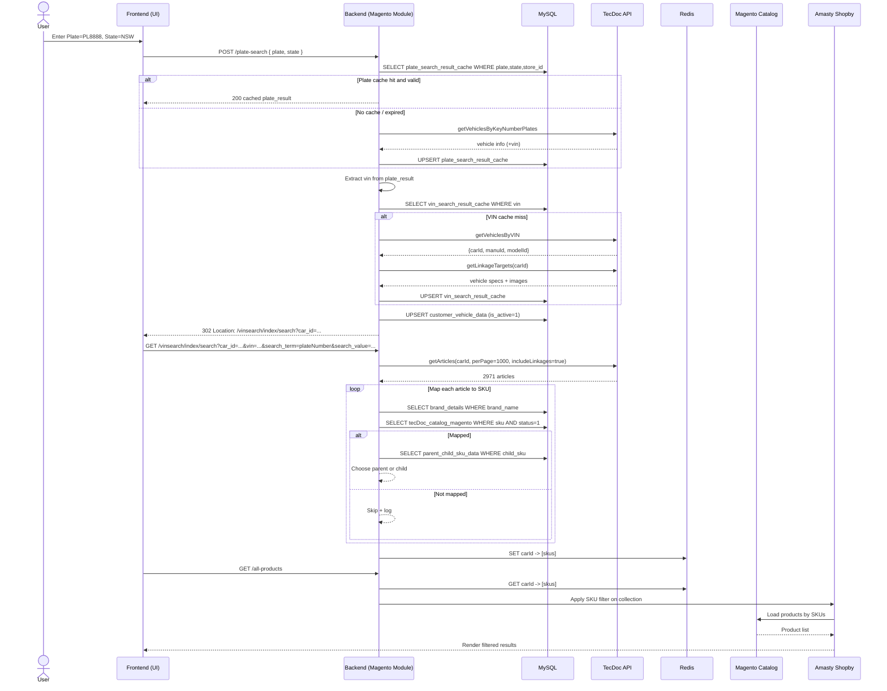
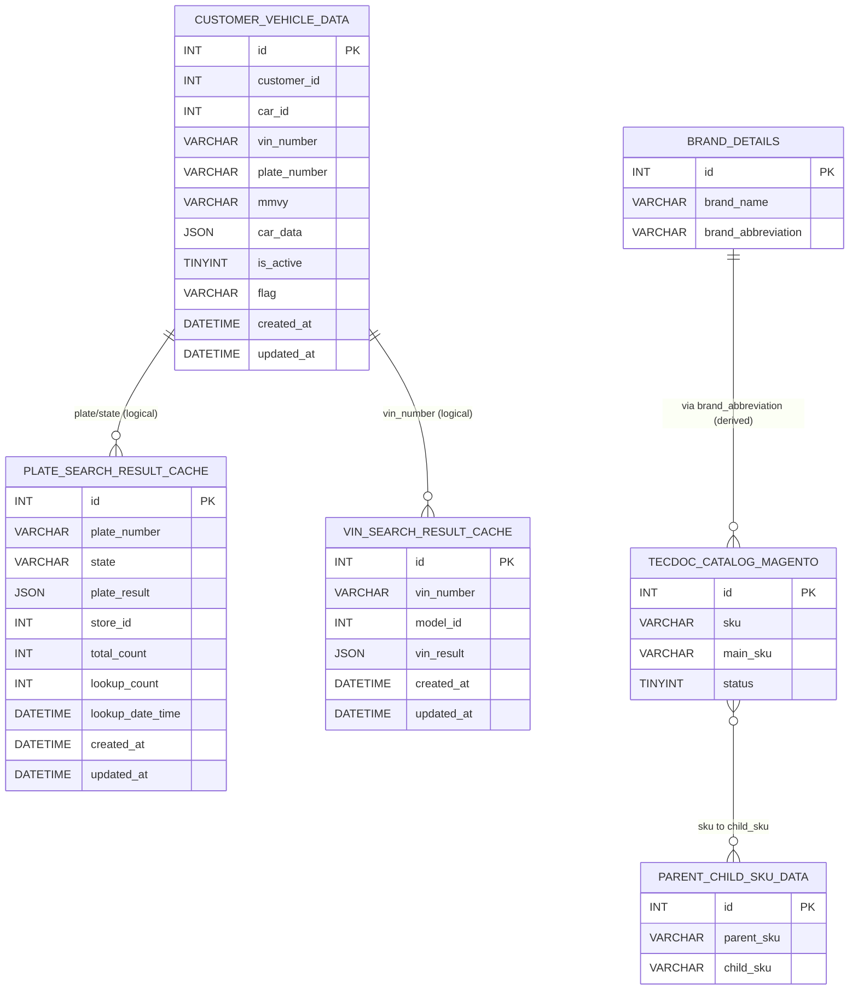

## Plate & Parts Search PDP (Product Design Plan)

### Purpose
Define the end-to-end Plate/VIN search and Parts catalog mapping flow, including API contracts, caching, data model, failure handling, and Magento (Amasty Shopby) integration. This PDP includes detailed diagrams for architecture and flows.

### Scope
- Plate lookup by plate number and state using TecDoc Pegasus 3.0 APIs
- VIN resolution and vehicle spec enrichment
- Parts discovery via articles linked to a vehicle (carId)
- SKU mapping to Magento catalog and parent-child consolidation
- Redis caching for compatible SKUs by vehicle
- Product filtering in Amasty Shopby to show only compatible products

### Systems & Components
- Frontend UI: Plate input, redirects to product listing
- Backend: Magento custom module/controllers and services
- External API: TecAlliance TecDoc (Pegasus 3.0)
- Datastore: MySQL tables described below
- Cache: Redis for per-vehicle SKU arrays
- Catalog: Magento product catalog and Amasty Shopby for layered navigation

---

## Flow Diagrams

### Plate Search Flow
```mermaid
flowchart TD
    A[User inputs Plate=PL8888, State=NSW and clicks Search] --> B{plate_search_result_cache hit?<br/>(plate_number,state,store_id)}

    B -- Yes --> C{Cache valid?<br/>lookup_count < 20 && age < 30 days}
    C -- Yes --> D[Return cached plate_result]
    C -- No --> F[API#1: getVehiclesByKeyNumberPlates]

    B -- No --> F

    F --> G[Save plate_search_result_cache<br/>lookup_count=1, lookup_date_time=NOW()]
    D --> E[Extract VIN from plate_result]
    G --> E

    E --> H{vin_search_result_cache hit?<br/>(vin_number)}
    H -- Yes --> I[Use cached vin_result]
    H -- No --> J[API#2: getVehiclesByVIN]
    J --> K[API#3: getLinkageTargets (carId)]
    K --> L[Save vin_search_result_cache<br/>(vin_number, model_id, vin_result)]

    I --> M[Redirect to vinsearch/index/search<br/>car_id, car_data, vin, search_term/value]
    L --> M
    M --> N[Persist customer_vehicle_data<br/>(customer_id, car_id, vin, plate, car_data, is_active=1)]
```

### Parts Search Flow
```mermaid
flowchart TD
    P1[Start Parts Search for carId=101050] --> P2[API#4: getArticles<br/>linkageTargetId=carId, perPage=1000, includeLinkages=true]
    P2 --> P3[Iterate articles]
    P3 --> P3a[Lookup brand_abbreviation in brand_details<br/>(by brand_name)]
    P3a --> P3b[Normalize articleNumber → digits/letters only]
    P3b --> P3c[Build SKU = brandAbbrev_articleNumberNormalized]
    P3c --> P3d{tecDoc_catalog_magento hit?<br/>sku AND status=1}
    P3d -- Yes --> P3e[Map to main_sku (child_sku)]
    P3d -- No --> P3skip[Skip and log unmappable]
    P3e --> P3f{parent_child_sku_data hit?<br/>child_sku → parent_sku}
    P3f -- Yes --> P3g[Use parent_sku]
    P3f -- No --> P3h[Use child_sku]
    P3g --> P4[Aggregate SKUs]
    P3h --> P4
    P3skip --> P4
    P4 --> P5[Save Redis key=carId value=[sku...]]
    P5 --> P6[Redirect to /all-products]
    P6 --> P7[Amasty Shopby: Filter product collection by SKUs and render]
```

### End-to-End Sequence Diagram


---

## Data Model (ER)


---

## API Contracts & Examples

### API#1 getVehiclesByKeyNumberPlates
- URL: `https://webservice.tecalliance.services/pegasus-3-0/...`
- Request:
```json
{
  "getVehiclesByKeyNumberPlates": {
    "country": "AU",
    "keySystemNumber": "pl8888-nsw",
    "keySystemType": 75,
    "provider": 22856,
    "details": true,
    "picture": true
  }
}
```
- Response (example subset):
```json
{
  "data": {
    "array": [
      {
        "carId": 101050,
        "carName": "BMW X4 (F26) xDrive 30 d",
        "vehicleDetails": {
          "vin": "WBAXX320500G76470",
          "bodyTypeOfVehicle": "SUV",
          "engineCode": "N57 D30 A",
          "yearFrom": "2014"
        }
      }
    ]
  }
}
```

### API#2 getVehiclesByVIN
- Request:
```json
{
  "getVehiclesByVIN": {
    "vin": "WBAXX320500G76470",
    "country": "au",
    "provider": 22856
  }
}
```
- Response (example subset):
```json
{
  "data": {
    "matchingVehicles": {
      "array": [
        { "carId": 101050, "manuId": 16, "modelId": 11945 }
      ]
    }
  }
}
```

### API#3 getLinkageTargets
- Request:
```json
{
  "getLinkageTargets": {
    "linkageTargetId": 101050,
    "linkageTargetType": "P",
    "provider": 22856
  }
}
```
- Response (example subset):
```json
{
  "data": {
    "array": [
      {
        "mfrName": "BMW",
        "vehicleModelSeriesName": "X4 (F26)",
        "beginYearMonth": "2014-04",
        "endYearMonth": "2018-03",
        "engineCode": "N57 D30 A",
        "vehicleImages": ["..."]
      }
    ]
  }
}
```

### API#4 getArticles
- Request:
```json
{
  "getArticles": {
    "linkageTargetId": 101050,
    "linkageTargetType": "p",
    "provider": 22856,
    "perPage": 1000,
    "includeLinkages": true
  }
}
```
- Response (example subset):
```json
{
  "data": {
    "array": [
      {
        "articleNumber": "0 986 479 727",
        "mfrName": "BOSCH",
        "linkages": [ { "criteria": ["..."] } ]
      }
    ]
  }
}
```

---

## Redirects & Contracts
- Controller: `vinsearch/index/search`
- Required parameters:
  - `car_id` (int): TecDoc carId (e.g., 101050)
  - `car_data` (JSON/base64 or reference id): vehicle specs payload
  - `search_term` (string): literal `'plateNumber'`
  - `search_value` (string): e.g., `'PL8888'`
  - `vin` (string): decoded VIN (e.g., `WBAXX320500G76470`)
- Behavior:
  - Resolves/validates `car_id`, fetches/warms parts cache (articles → SKUs)
  - On success: redirects to `/all-products` with no query SKU list; filtering is server-side via Redis lookup

---

## Caching Strategy

### Plate Search Cache (MySQL: `plate_search_result_cache`)
- Key: `plate_number + state + store_id`
- Valid if: `lookup_count < 20` AND `days_since(lookup_date_time) < 30`
- On access:
  - If valid: increment `lookup_count` and return cached `plate_result`
  - If missing/invalid: call API#1 and replace with `lookup_count = 1`, `lookup_date_time = NOW()`

### VIN Search Cache (MySQL: `vin_search_result_cache`)
- Key: `vin_number + model_id`
- Expiry: No automatic expiry (manual cleanup/rotation)
- Update: Replace on new search for the same key

### Redis Vehicle SKUs
- Key: `carId` (consider namespace prefix like `vehicle:skus:{carId}`)
- Value: Array of final SKUs (strings)
- Expiry: No automatic expiry (replace on new parts search)

---

## SKU Mapping & Magento Integration

### Normalization
- `brand_abbreviation`: lookup from `brand_details` by case-insensitive `brand_name`
- `articleNumberNormalized`:
  - Remove spaces and punctuation
  - Keep digits and letters only
  - Preserve leading zeros
  - Example: `"0 986 479 727" → "0986479727"`
- `skuCandidate`: `"{brand_abbreviation}_{articleNumberNormalized}"`

### Catalog Mapping
1. Find `tecDoc_catalog_magento` by `skuCandidate` and `status = 1`
   - If found, take `main_sku` as `child_sku`
   - If not found, skip and log for manual review
2. Check `parent_child_sku_data` for `child_sku`
   - If parent exists, use `parent_sku` as final SKU
   - Else use `child_sku` as final SKU
3. Aggregate final SKUs, store to Redis under `carId`

### Amasty Shopby Customization
- File: `app/code/Amasty/Shopby/Model/ResourceModel/Fulltext/Collection.php`
- Logic:
  1. Resolve active `carId` for current customer/session from `customer_vehicle_data`
  2. Fetch SKUs from Redis using `carId`
  3. Apply an `IN` filter on product collection by SKU (or `entity_id` via subselect)
  4. Respect existing layered navigation filters

---

## Error Handling & Observability

### API Failures
- Retry with exponential backoff (e.g., 250ms, 500ms, 1s; jitter; max 3 attempts)
- On persistent failure:
  - Use cached data (if present) for degraded experience
  - Surface user-friendly message; log error with correlation id

### Cache Misses
- Fall back to API calls; after success, warm corresponding caches
- Optionally queue background warming for the parts list (articles → SKUs)

### SKU Mapping Failures
- Skip unmappable articles, continue processing others
- Log `brand_name`, `articleNumber`, and reason (no brand_abbreviation, no sku match, etc.)

### Database Errors
- Wrap writes in transactions where multiple tables are affected
- Rollback on failure; return friendly error to user and log with full context

### Monitoring
- Metrics: API latency/success rate, cache hit rate, SKU mapping coverage, product filter application time
- Logs: Structured JSON with request ids; store stack traces for failures

---

## Performance & Indexing
- Recommended indices:
  - `plate_search_result_cache(plate_number, state, store_id)`
  - `vin_search_result_cache(vin_number, model_id)`
  - `brand_details(brand_name)`
  - `tecDoc_catalog_magento(sku, status)` and/or `(main_sku)`
  - `parent_child_sku_data(child_sku)` and `(parent_sku)`
  - `customer_vehicle_data(customer_id, is_active)` and `(car_id)`
- Batch processing: process articles in chunks; pipeline Redis writes
- Pagination: API#4 uses `perPage=1000`; consider paging if higher volumes

---

## Security & Compliance
- Protect API credentials (server-side only)
- Rate-limit plate/VIN search endpoints
- Validate inputs (plate/state/vin) and sanitize before use
- Avoid storing PII beyond what is required; respect data retention policies

---

## Open Questions / Decisions
- Confirm namespace for Redis keys (e.g., `vehicle:skus:{carId}`)
- Define maximum allowed articles to process per request (to bound latency)
- Determine if `car_data` is stored inline JSON or a reference id to an object store
- Decide on TTL strategy (if any) for Redis SKUs or keep manual invalidation only

---

## Appendix: Example Redirect Contract
```json
{
  "route": "vinsearch/index/search",
  "params": {
    "car_id": 101050,
    "car_data": { "mfrName": "BMW", "vehicleModelSeriesName": "X4 (F26)" },
    "search_term": "plateNumber",
    "search_value": "PL8888",
    "vin": "WBAXX320500G76470"
  }
}
```

