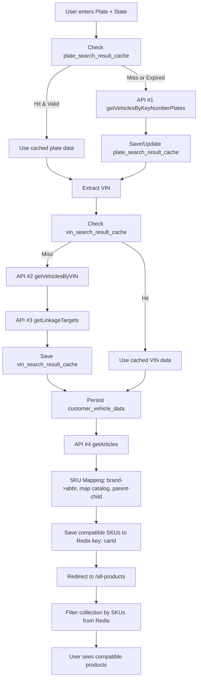
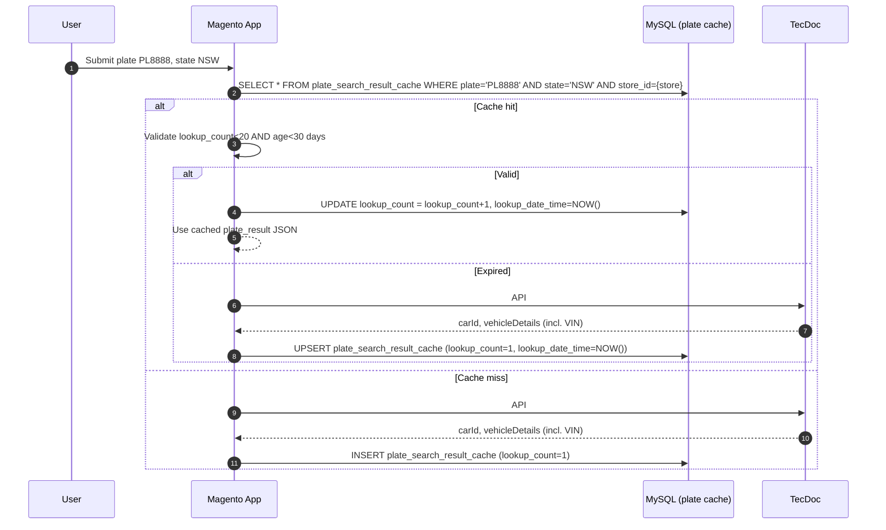
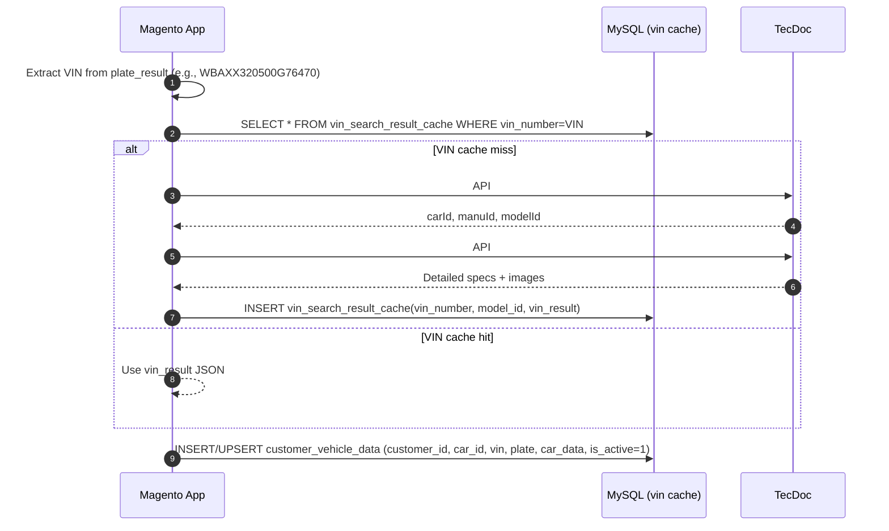
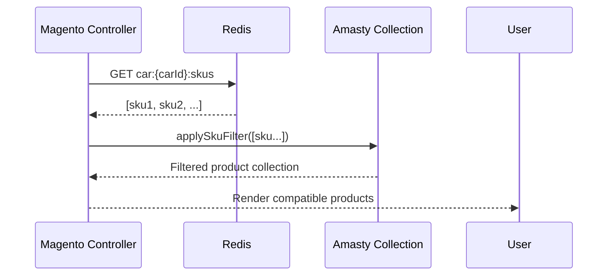
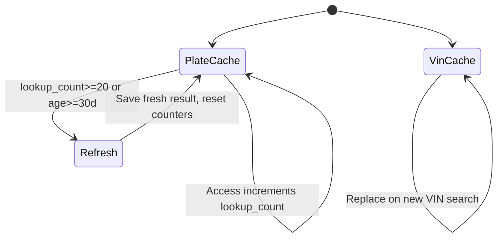
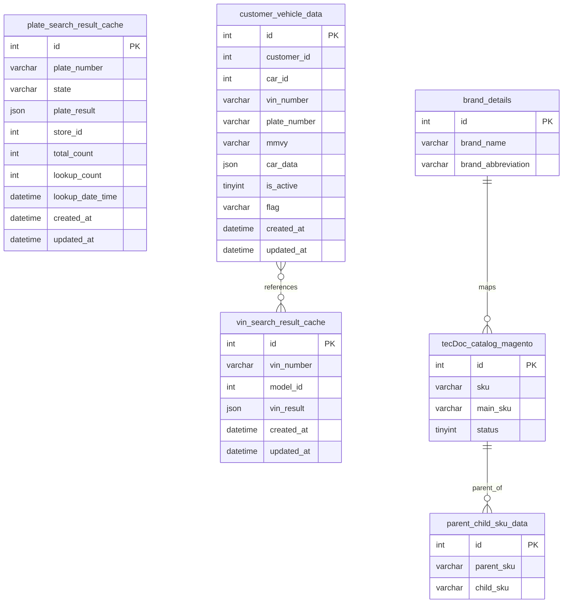

## Product Design Plan (PDP): Plate to Parts Search & Filtering

### Goals & Scope
- **Goal**: Enable users to search by plate and see only compatible products, with resilient caching and fast UX.
- **In scope**: Plate search, VIN resolution, TecDoc calls, SKU mapping, Redis caching, Magento filtering integration, persistence, error handling, observability.
- **Out of scope**: Pricing rules, checkout, fulfillment.

### Actors & Systems
- **User**: Provides plate and state; views compatible products.
- **Web App (Magento)**: Orchestrates flow, caches, persists, filters products.
- **TecDoc APIs**: getVehiclesByKeyNumberPlates, getVehiclesByVIN, getLinkageTargets, getArticles.
- **Databases**: MySQL tables for caches and mappings.
- **Redis**: Stores compatible SKU arrays keyed by `carId`.

### High-Level End-to-End Flow


### Plate Search Flow (Cache + API)


### VIN Resolution Flow (Cache + API)


### Parts Retrieval & SKU Mapping
```mermaid
flowchart LR
    A[carId] --> B[API #4 getArticles(linkageTargetId=carId, perPage=1000, includeLinkages=true)]
    B --> C{For each article}
    C --> D[Lookup brand_abbreviation by brand_name]
    D --> E[Build SKU: abbr + '_' + normalized articleNumber]
    E --> F[Query tecDoc_catalog_magento by sku & status=1]
    F -->|Found main_sku| G[Resolve main_sku]
    F -->|Not found| H[Skip + log]
    G --> I[Check parent_child_sku_data by child_sku=main_sku]
    I -->|Parent exists| J[Final SKU = parent_sku]
    I -->|No parent| K[Final SKU = main_sku]
    J --> L[Collect Final SKUs]
    K --> L[Collect Final SKUs]
    L --> M[Save SKUs array to Redis key=carId]
```

### Product Filtering Integration (Amasty Shopby)
- **Entry**: Redirect to `/all-products` after SKUs saved to Redis
- **Customization**: `app/code/Amasty/Shopby/Model/ResourceModel/Fulltext/Collection.php`
- **Logic**:
  - Retrieve active `carId` for current user from `customer_vehicle_data`
  - Fetch SKUs array from Redis key `car:{carId}:skus` (see Keys below)
  - Apply inclusion filter to product collection for these SKUs
  - Return paginated, faceted compatible products only



### Caching Strategy
- **Plate Search Cache**
  - **Key**: `plate_number:{plate}|state:{state}|store:{store_id}`
  - **Validity**: `lookup_count < 20` AND `age_in_days < 30`
  - **On access**: increment `lookup_count`, update `lookup_date_time`
  - **On miss/expired**: refresh via API, reset `lookup_count = 1`
- **VIN Search Cache**
  - **Key**: `vin_number:{vin}|model_id:{model_id}`
  - **Expiry**: none (manual cleanup)
  - **Update**: replace on new search
- **Redis Compatible SKUs**
  - **Key**: `car:{carId}:skus`
  - **Value**: array of final SKUs
  - **Expiry**: none (manual invalidation on parts refresh)



### Database Schema (ER)


### Data Contracts (Requests & Responses)
- **API #1 getVehiclesByKeyNumberPlates (POST)**
```json
{
  "getVehiclesByKeyNumberPlates": {
    "country": "AU",
    "keySystemNumber": "pl8888-nsw",
    "keySystemType": 75,
    "provider": 22856,
    "details": true,
    "picture": true
  }
}
```
- Example response (truncated):
```json
{
  "data": {
    "array": [
      {
        "carId": 101050,
        "carName": "BMW X4 (F26) xDrive 30 d",
        "vehicleDetails": {
          "vin": "WBAXX320500G76470",
          "bodyTypeOfVehicle": "SUV",
          "engineCode": "N57 D30 A",
          "yearFrom": "2014"
        }
      }
    ]
  }
}
```

- **API #2 getVehiclesByVIN (POST)**
```json
{
  "getVehiclesByVIN": {
    "vin": "WBAXX320500G76470",
    "country": "au",
    "provider": 22856
  }
}
```
- Example response (truncated):
```json
{
  "data": {
    "matchingVehicles": {
      "array": [
        { "carId": 101050, "manuId": 16, "modelId": 11945 }
      ]
    }
  }
}
```

- **API #3 getLinkageTargets (POST)**
```json
{
  "getLinkageTargets": {
    "linkageTargetId": 101050,
    "linkageTargetType": "P",
    "provider": 22856
  }
}
```
- Example response (truncated):
```json
{
  "data": {
    "array": [
      {
        "mfrName": "BMW",
        "vehicleModelSeriesName": "X4 (F26)",
        "beginYearMonth": "2014-04",
        "endYearMonth": "2018-03",
        "engineCode": "N57 D30 A",
        "vehicleImages": []
      }
    ]
  }
}
```

- **API #4 getArticles (POST)**
```json
{
  "getArticles": {
    "linkageTargetId": 101050,
    "linkageTargetType": "p",
    "provider": 22856,
    "perPage": 1000,
    "includeLinkages": true
  }
}
```
- Example response (truncated):
```json
{
  "data": {
    "array": [
      {
        "articleNumber": "0 986 479 727",
        "mfrName": "BOSCH",
        "linkages": [
          { "criteria": [ { "name": "Axle", "value": "Rear" } ] }
        ]
      }
    ]
  }
}
```

### SKU Mapping Rules
- **Brand abbreviation**: From `brand_details` by exact `brand_name` match; if missing, fallback to normalized brand name (lowercase, remove spaces/punct).
- **Article normalization**: Remove spaces and punctuation, keep digits and letters only.
- **SKU construction**: `<brand_abbreviation>_<normalizedArticleNumber>` e.g., `bsch_0986479727`.
- **Catalog lookup**: `tecDoc_catalog_magento` where `sku = constructedSku` and `status = 1`.
- **Parent resolution**: If a `parent_child_sku_data` row exists for `child_sku = main_sku`, use `parent_sku` as final SKU.
- **Deduplication**: De-duplicate final SKU array before writing to Redis.

### Redis Keys & Invalidation
- **Compatible SKUs for carId**: `car:{carId}:skus` → JSON array of strings.
- **Invalidation triggers**:
  - New parts search for same `carId` replaces the entire array.
  - Admin reindex/catalog sync triggers rebuild for affected SKUs.

### Redirects & UI Parameters
- Redirect to: `vinsearch/index/search`
- Parameters:
  - `car_id`: numeric
  - `car_data`: JSON (stringified)
  - `search_term`: constant `'plateNumber'`
  - `search_value`: submitted plate
  - `vin`: extracted VIN

### Error Handling & Resilience
- **API failures**:
  - Retry with exponential backoff (e.g., 3 attempts, delays 200ms, 800ms, 2s)
  - Fallback to last cached data when available
  - Circuit-breaker counters per endpoint to protect upstream
- **Cache misses**: Degrade gracefully to API calls, then warm caches in background where possible
- **SKU mapping failures**: Skip unmappable items; log with context `{carId, brand, articleNumber}`
- **Database errors**: Wrap write operations in transactions; on failure, rollback and surface user-friendly message
- **Timeouts**: Per API call timeout (e.g., 8s) with cancellation

### Observability & Logging
- **Structured logs**: Include correlationId, customerId, carId, plate, vin, state, endpoint, latencyMs, statusCode, errorCode
- **Metrics**:
  - Success/error rates per endpoint
  - Cache hit/miss ratios (plate, vin, redis)
  - SKU mapping coverage (% mapped of total articles)
  - Page load and TTFB for `/all-products`
- **Tracing**: Span around each external call; propagate correlationId across internal layers

### Security & Privacy
- **API credentials**: Store TecDoc keys in secure secrets store; never log secrets
- **PII**: Treat plate and VIN as sensitive; redact in logs except last 4 chars
- **Access control**: `customer_vehicle_data` rows scoped by `customer_id`
- **Rate limiting**: Client-side throttle and server-side rate limits per IP/session for plate lookups

### Performance & Scalability Considerations
- Batch `getArticles` with `perPage=1000`; paginate if needed; stream processing of articles
- Perform brand abbreviation lookups via in-memory map snapshot (refresh periodically)
- Parallelize SKU mapping for large article lists (size > 1000), then join and de-duplicate
- Redis writes are O(N); compress payload if large; consider chunking if over size threshold

### Edge Cases & Business Rules
- Multiple vehicles in plate API response: pick best match by country/state and completeness; if ambiguous, prompt user to select
- VIN not present in plate result: proceed with VIN API by car identifiers if available; else ask manual VIN entry
- No compatible articles: show empty state and invite user to contact support
- Brand not found in `brand_details`: auto-generate abbreviation from brand name; log warning
- Duplicate parent-child mappings: prefer the most recent or highest priority rule

### Pseudocode Snippets
```pseudo
function searchByPlate(plate, state, storeId, customerId):
  plateCache = loadPlateCache(plate, state, storeId)
  if plateCache and isValid(plateCache):
    incrementLookup(plateCache)
    plateData = plateCache.plate_result
  else:
    plateData = tecdoc.getVehiclesByKeyNumberPlates(plate, state)
    savePlateCache(plate, state, storeId, plateData)

  vin = extractVIN(plateData)
  vinCache = loadVinCache(vin)
  if not vinCache:
    vinData = tecdoc.getVehiclesByVIN(vin)
    details = tecdoc.getLinkageTargets(vinData.carId, 'P')
    saveVinCache(vin, vinData.modelId, details)
  else:
    details = vinCache.vin_result

  saveCustomerVehicle(customerId, details.carId, vin, plate, details)

  articles = tecdoc.getArticles(details.carId)
  skus = mapArticlesToSkus(articles)
  redis.set(`car:${details.carId}:skus`, unique(skus))
  redirectToAllProducts(details.carId)
```

### Ownership & Versioning
- **Owner**: Platform Team — Magento Integration
- **Last updated**: 2025-09-21
- **Changelog**: v1.0 initial PDP with diagrams and data contracts