# TecDoc Integration Flow Diagram

## Overview
This diagram illustrates the complete flow of the ASV B2B website's integration with TecDoc for vehicle identification and parts lookup using plate numbers.

## Flow Diagram

```mermaid
graph TD
    A[User enters Plate Number<br/>PL8888 + State] --> B{Check plate_search_result_cache}
    
    B -->|Found & Valid<br/>lookup_count < 20<br/>< 30 days| C[Get cached plate data]
    B -->|Not found or expired| D[Call TecDoc API:<br/>getVehiclesByKeyNumberPlates]
    
    D --> E[Save result to<br/>plate_search_result_cache<br/>lookup_count = 1]
    
    C --> F{Does result have VIN?}
    E --> F
    
    F -->|Yes| G{Check vin_search_result_cache<br/>for VIN data}
    F -->|No| R[Show error or<br/>limited vehicle info]
    
    G -->|Found| H[Get cached VIN data]
    G -->|Not found| I[Call TecDoc API:<br/>getVehiclesByVIN]
    
    I --> J[Call TecDoc API:<br/>getLinkageTargets<br/>with carId]
    
    J --> K[Save VIN data to<br/>vin_search_result_cache]
    
    H --> L[Extract carId from data]
    K --> L
    
    L --> M[Redirect to vinsearch/index/search<br/>with car_id, car_data, search_term, etc.]
    
    M --> N[Save to customer_vehicle_data table]
    
    N --> O{Check Redis for<br/>carId products}
    
    O -->|Found| P[Get SKUs from Redis]
    O -->|Not found| Q[Call TecDoc API:<br/>getArticles with carId]
    
    Q --> S[Process Articles Data:<br/>Extract mfrName & articleNumber]
    
    S --> T[Step A: Find brand_abbreviation<br/>from brand_details table<br/>using mfrName]
    
    T -->|Found| U[Step B: Find SKU from<br/>tecDoc_catalog_magento<br/>using brandAbbr_articleNumber]
    T -->|Not found| V[Step D: Check parent_child_sku_data<br/>using mfrName_articleNumber]
    
    U -->|Found & status=1| W[Step C: Find parent_sku from<br/>parent_child_sku_data<br/>using child SKU]
    U -->|Not found| X[Use brandAbbr_articleNumber as SKU]
    
    W --> Y[Add parent_sku to SKUs array]
    X --> Z[Add child_sku to SKUs array]
    V --> AA[Add parent_sku to SKUs array]
    
    Y --> BB[Save SKUs array to Redis]
    Z --> BB
    AA --> BB
    P --> CC[Redirect to /all-products]
    BB --> CC
    
    CC --> DD{Is customer logged in?}
    
    DD -->|Yes| EE[Get carId from<br/>customer_vehicle_data]
    DD -->|No| FF[Show all products]
    
    EE --> GG[Get SKUs from Redis<br/>based on carId]
    
    GG --> HH[Apply custom filtering logic<br/>in Amasty/Shopby/Model/ResourceModel/<br/>Fulltext/Collection.php]
    
    HH --> II[Display filtered products<br/>based on plate ID]
    FF --> JJ[Display all products]

    %% Styling
    classDef apiCall fill:#e1f5fe,stroke:#0277bd,stroke-width:2px
    classDef database fill:#f3e5f5,stroke:#7b1fa2,stroke-width:2px
    classDef cache fill:#e8f5e8,stroke:#388e3c,stroke-width:2px
    classDef decision fill:#fff3e0,stroke:#f57c00,stroke-width:2px
    classDef process fill:#fce4ec,stroke:#c2185b,stroke-width:2px
    
    class D,I,J,Q apiCall
    class E,K,N,T,U,W,V database
    class B,G,O,BB cache
    class F,G,O,DD decision
    class S,HH process
```



## API Endpoints and Payloads

### 1. getVehiclesByKeyNumberPlates
**URL:** `https://webservice.tecalliance.services/pegasus-3-0/services/TecdocToCatDLB.jsonEndpoint`

**Payload:**
```json
{
  "getVehiclesByKeyNumberPlates": {
    "country": "AU",
    "details": true,
    "keySystemNumber": "pl8888-nsw",
    "keySystemType": 75,
    "lang": "qb",
    "linkingTargetType": "p",
    "picture": true,
    "provider": 22856
  }
}
```

### 2. getVehiclesByVIN
**URL:** `https://webservice.tecalliance.services/pegasus-3-0/services/TecdocToCatDLB.jsonEndpoint`

**Payload:**
```json
{
  "getVehiclesByVIN": {
    "lang": "qb",
    "provider": 22856,
    "country": "au",
    "vin": "WBAXX320500G76470"
  }
}
```

### 3. getLinkageTargets
**URL:** `https://webservice.tecalliance.services/pegasus-3-0/services/TecdocToCatDLB.jsonEndpoint`

**Payload:**
```json
{
  "getLinkageTargets": {
    "provider": 22856,
    "linkageTargetCountry": "au",
    "lang": "qb",
    "linkageTargetType": "P",
    "linkageTargetIds": {
      "type": "P",
      "id": 101050
    }
  }
}
```

### 4. getArticles
**URL:** `https://webservice.tecalliance.services/pegasus-3-0/services/TecdocToCatDLB.jsonEndpoint`

**Payload:**
```json
{
  "getArticles": {
    "articleCountry": "au",
    "provider": 22856,
    "linkageTargetId": 101050,
    "linkageTargetType": "p",
    "lang": "qb",
    "perPage": 1000,
    "includeLinkages": true
  }
}
```

## Database Tables

### Cache Tables
- **plate_search_result_cache**: Stores plate search results with expiry logic
- **vin_search_result_cache**: Stores VIN search results

### Product/SKU Tables
- **brand_details**: Maps manufacturer names to brand abbreviations
- **tecDoc_catalog_magento**: Maps brand abbreviation + article number to SKUs
- **parent_child_sku_data**: Maps child SKUs to parent SKUs
- **customer_vehicle_data**: Stores customer's selected vehicle data

## Key Logic Points

### Caching Logic
- Plate data cached for 30 days with lookup count < 20
- VIN data cached indefinitely
- SKUs cached in Redis by carId

### SKU Resolution Process
1. **Step A**: Find brand abbreviation from `brand_details` using `mfrName`
2. **Step B**: Find SKU from `tecDoc_catalog_magento` using `brandAbbr_articleNumber`
3. **Step C**: Find parent SKU from `parent_child_sku_data` if status = 1
4. **Step D**: Fallback to direct lookup in `parent_child_sku_data` using `mfrName_articleNumber`

### Product Filtering
- Custom filtering logic in `app/code/Amasty/Shopby/Model/ResourceModel/Fulltext/Collection.php`
- Filters products based on SKUs associated with the vehicle's carId
- Different behavior for logged-in vs anonymous users

## Extensions Used
- **Asv_VinSearch**: Main module for vehicle identification
- **Asv_Redis**: Redis caching functionality
- **Asv_ImportCatalog**: Catalog import functionality
- **Amasty_Shopby**: Product filtering and display