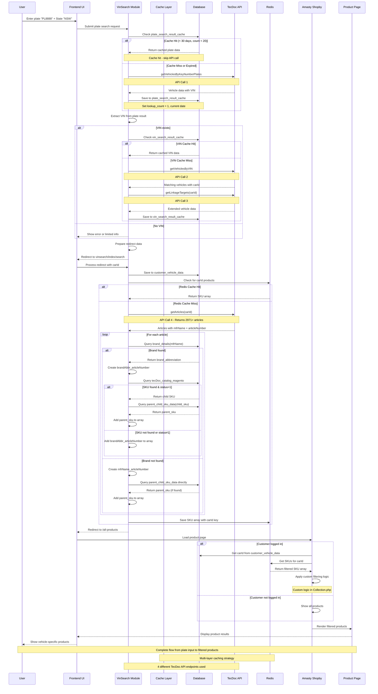
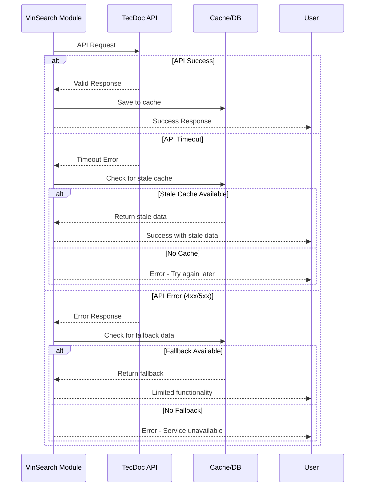

# TecDoc API Sequence Diagram

## Complete Vehicle Search Sequence

## API Call Details & Timing

### Critical Path Analysis

```mermaid
gantt
    title TecDoc Integration Timeline
    dateFormat X
    axisFormat %s

    section Cache Checks
    Check Plate Cache    :0, 100
    Check VIN Cache      :100, 200
    Check Redis SKUs     :800, 900

    section TecDoc API Calls
    getVehiclesByKeyNumberPlates :200, 1500
    getVehiclesByVIN            :1500, 2000
    getLinkageTargets           :2000, 2500
    getArticles                 :3000, 8000

    section Data Processing
    Save Plate Data     :1500, 1600
    Save VIN Data       :2500, 2600
    Process Articles    :8000, 12000
    SKU Resolution      :12000, 15000
    Save to Redis       :15000, 15500

    section User Experience
    Initial Response    :0, 2600
    Product Loading     :15500, 16000
```

## Error Handling Sequence

## Performance Metrics

### Expected Response Times
- **Cache Hit**: < 100ms
- **Single API Call**: 300-800ms  
- **Full Flow (4 API calls)**: 2-5 seconds
- **Article Processing**: 3-8 seconds (2971+ articles)
- **SKU Resolution**: 2-5 seconds
- **Total First Visit**: 8-15 seconds
- **Subsequent Visits**: < 1 second (cached)

### Optimization Points
1. **Parallel API Calls**: Where possible, make concurrent requests
2. **Batch Processing**: Process articles in chunks
3. **Progressive Loading**: Show vehicle data while processing products
4. **Background Jobs**: Process heavy SKU resolution asynchronously
5. **CDN Caching**: Cache static vehicle images and data